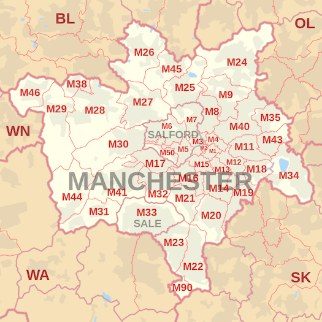

# Well Pharmacy Technical Assessment
[Click Here](https://well-pharmacy-technical-assess.herokuapp.com/swagger-ui.html) to be taken the deployed application which is hosted on heroku.

 ## Prerequisites
 - Java JDK 13
 - Gradle
 
 ## System architecture outline
The application uses port 8080, and uses Spring Boot, Junit 5 and Lombok. 

## Endpoints
- ```http://localhost:8080/``` or ```https://well-pharmacy-technical-assess.herokuapp.com/swagger-ui.html``` Swagger Endpoint 
- ```http://localhost:8080/surgeries``` or ```https://well-pharmacy-technical-assess.herokuapp.com/surgeries```  get number of surgeries in area/City by outward postcode.
- ```http://localhost:8080/surgeries/topsurgeries/{topSurgeries}``` or ```https://well-pharmacy-technical-assess.herokuapp.com/surgeries/topsurgeries/{topSurgeries}``` get most number of surgeries in area/City  (replace {topSurgeries} with the number value  top 5, for example: ```http://localhost:8080/surgeries/topsurgeries/5```)


## How to run the application locally
### To run this application without an IDE.
1. Open Terminal or Command Line/ PowerShell.
2. Navigate to the location where the project has been download or cloned.
3. Run `./gradlew clean bootrun` which would run the project.
4.Go to your web browser and type in localhost:8080 or [click here](http://localhost:8080) you would be introduced to a swagger documentation outlining the endpoint and the request and response body to use the API.

# Help me open a pharmacy

## Task

Write code that helps Well open a new pharmacy in the Manchester area and make loads of money.

```
AS A
    Pharmacist
WHEN I
    Am looking to open a new Pharmacy in the Manchester area
I WANT
    To know where there are a lot of surgeries
SO THAT
    I can make more money.
```

I'd like to see:

- A historgram of the number of surgeries by Outward Code, e.g.:
  - M12: 3 (7.5%)
  - M21: 10 (25%)
  - M4: 5 (12.5%)
  - M15: 3 (7.5%)
  - M1: 5 (12.5%)
- Additional requirement may be to show the top 5 zones.

The outward code is the first part of the postcode before the space, e.g. if you take `M12 6BN`, `M12` is the outward code.

This is the list of postcodes in the Manchester area:


Use any programming language you like. Web/mobile application or console application is fine.

The dataset is in the file `data.json`.

Sample data:

```json
{
  "date": "2019-01-17T09:13:00.016Z",
  "list": [
    {
      "name": "HMP MANCHESTER (HIGH SECURITY)",
      "addressLine1": "SOUTHALL STREET",
      "addressLine2": "",
      "city": "MANCHESTER",
      "postcode": "M60 9AH",
      "phone": "0161 8175600"
    },
    {
      "name": "OLDHAM 7 DAY ACCESS HUB3 OOH",
      "addressLine1": "FAILSWORTH HEALTH CENTRE",
      "addressLine2": "ASHTON RD WEST,FAILSWORTH",
      "city": "MANCHESTER",
      "postcode": "M35 0AD",
      "phone": "0161 6811401"
    },
    {
      "name": "NL COMMUNITY RESPIRATORY SERVICE",
      "addressLine1": "BOC RESPIRATORY SERVICES",
      "addressLine2": "PRIESTLEY ROAD",
      "city": "WORSLEY",
      "postcode": "M28 2UT",
      "phone": "0800 0121858"
    }
  ]
}
```
